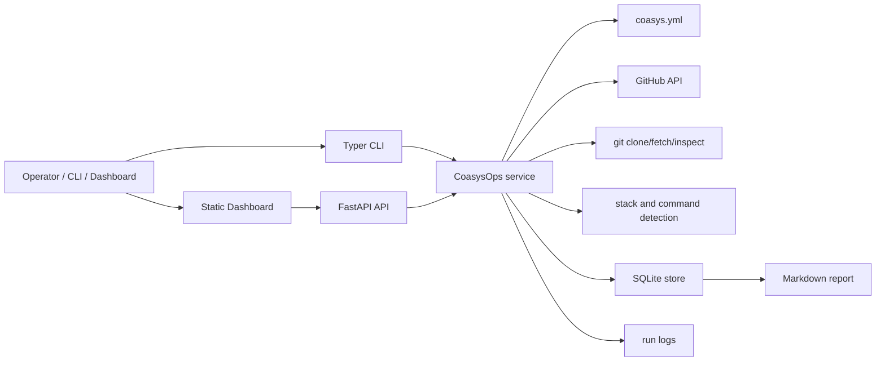

# Architecture

Coasys Ops is a local control plane for the public `github.com/coasys`
organization. It manages clones, records repository health, detects runnable
commands, executes only configured safe checks, and exposes the state through a
FastAPI API plus a static dashboard.

## Goals

- Keep every public Coasys repository cloned or fetchable under one workspace.
- Classify repositories so core, active, language, dependency-fork, and stale
  work can be operated progressively.
- Detect useful local commands without treating every detected command as safe
  to run.
- Require explicit playbooks for start and deploy operations.
- Record every meaningful operation in SQLite with logs under ignored state.
- Provide a dashboard for scanning fleet health, drill-down, and operator
  actions.

## Non-Goals

- Hosted multi-user service operation.
- Automatic cloud deployment.
- Secret storage in the repository.
- Running detected deploy scripts without explicit promotion into `coasys.yml`.
- Long-lived fleet service orchestration beyond the local dashboard.

## Component Map

## Runtime Modules

| Module | Responsibility |
| --- | --- |
| `coasys_ops.cli` | Typer command surface and dashboard server entrypoint. |
| `coasys_ops.api` | FastAPI app, JSON endpoints, Markdown report endpoint, static files. |
| `coasys_ops.ops` | Fleet orchestration, validation, playbook gating, reporting. |
| `coasys_ops.config` | `coasys.yml` parsing and typed override/playbook models. |
| `coasys_ops.github_api` | GitHub organization inventory and latest workflow metadata. |
| `coasys_ops.gitops` | Git clone/fetch, checkout inspection, command execution. |
| `coasys_ops.detect` | Stack and command discovery from repo files. |
| `coasys_ops.classify` | Tier classification rules and override precedence. |
| `coasys_ops.store` | SQLite schema and persistence for repositories and runs. |
| `coasys_ops.static` | Browser dashboard assets. |

## Data Flow

1. `sync` asks GitHub for public org repos.
2. Each repo is cloned or fetched under `workspace/repos/<repo-name>`.
3. Git status, branch, HEAD, ahead/behind, dirty state, stacks, and commands are
   detected from the local checkout.
4. Metadata and detection results are written to
   `workspace/state/coasys.sqlite3`.
5. `validate` refreshes command detection, checks Git state, fetches latest CI
   metadata when available, and runs only automatic or explicitly enabled
   validation commands.
6. `run` and `operate` create rows in `runs`, write log tails under
   `workspace/state/logs/`, and update dashboard-visible derived states.
7. `report` derives a Markdown operating ledger from SQLite and config.

## Safety Boundaries

Start, dev, serve, deploy, and release profiles are gated. For these profiles:

- A repo must have an explicit playbook or profile in `coasys.yml`.
- The operator must request `--dry-run` or `--execute`.
- Deploy execution additionally requires the latest deploy dry run to have
  passed.
- Missing required env vars block execution.
- `working_dir` is resolved inside the local clone and cannot escape the repo.

Detected commands are useful inventory, not approval. A detected deploy or start
script stays blocked until it is copied into an explicit playbook.

